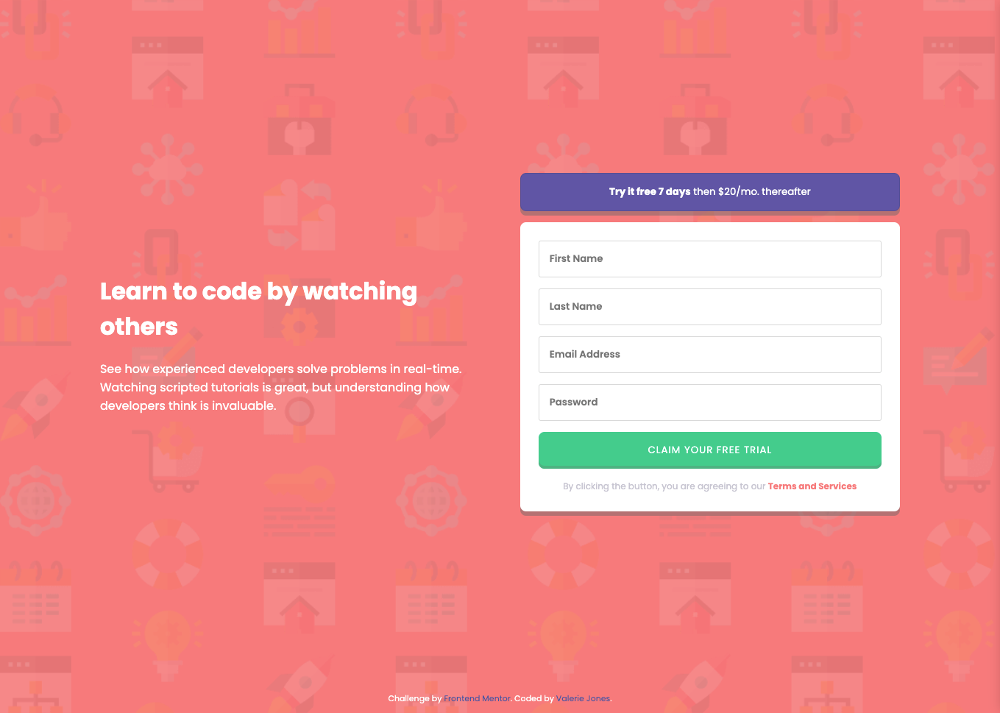

# Frontend Mentor - Intro component with sign up form solution

This is a solution to the [Intro component with sign up form challenge on Frontend Mentor](https://www.frontendmentor.io/challenges/intro-component-with-signup-form-5cf91bd49edda32581d28fd1). Frontend Mentor challenges help you improve your coding skills by building realistic projects.

## Table of contents

- [Overview](#overview)
  - [The challenge](#the-challenge)
  - [Screenshot](#screenshot)
  - [Links](#links)
- [My process](#my-process)
  - [Built with](#built-with)
  - [What I learned](#what-i-learned)
  - [Continued development](#continued-development)
  - [Useful resources](#useful-resources)
- [Author](#author)

## Overview

### The challenge

Users should be able to:

- View the optimal layout for the site depending on their device's screen size
- See hover states for all interactive elements on the page
- Receive an error message when the `form` is submitted if:
  - Any `input` field is empty. The message for this error should say _"[Field Name] cannot be empty"_
  - The email address is not formatted correctly (i.e. a correct email address should have this structure: `name@host.tld`). The message for this error should say _"Looks like this is not an email"_

### Screenshot



### Links

- Solution URL: [https://github.com/vljones133/intro-component-signup-form](https://github.com/vljones133/intro-component-signup-form)
- Live Site URL: [https://intro-component-signup-form-plum.vercel.app](https://intro-component-signup-form-plum.vercel.app)

## My process

This past year, I've been getting chummy with React, Bootstrap, and other styling frameworks. For 3.5 years, before my 5-year coding hiatus, I was a front-end developer who focused mainly on vanilla CSS and JavaScript. My goal with this initial Frontend Mentor project was to make sure I kept those vanilla skills sharp and to ensure I haven't gotten too rusty or dependent on libraries and frameworks. Now that I've completed this project, I am happy to say that I've still got it!

### Built with

- Semantic HTML5 markup
- CSS custom properties
- Flexbox
- CSS Grid
- Responsive layout
- Vanilla JavaScript
- Client-side form validation

### What I learned

One thing I did do differently this time was create my own CSS variables. In the past, I had used variables that were already set inside templates, but this time I created my own. Just as easy as setting JS variables, and I'll be using them for continuity from here on out!

Also, in the past, I have deployed projects with Heroku, GitHub Pages, and Netlify. This time I wanted to give Vercel a shot. Easy peasy!

Some code highlights:

```css
:root {
  --coral: hsl(0, 100%, 74%);
  --green: hsl(154, 59%, 51%);
  --blue-purple: hsl(248, 32%, 49%);
  --dark-blue: hsl(249, 10%, 26%);
  --grayish-blue: hsl(246, 25%, 77%);
}

input.invalid {
  border: 2px solid var(--coral) !important;
  background-image: url(./images/icon-error.svg);
  background-repeat: no-repeat;
  background-attachment: initial;
  background-size: 20px 20px;
  background-position: right;
  background-position-x: 96%;
}
```

```js
const form = document.querySelector('form');
const input = document.getElementsByTagName('input');

window.addEventListener('load', () => {
  input.className = 'valid';
});
```

### Continued development

For my next project, I plan to continue working with vanilla JS and DOM, but will also learn and implement SASS/SCSS.

My favorite tutorial websites:

- freeCodeCamp: [https://www.freecodecamp.org/learn/front-end-development-libraries/#sass](https://www.freecodecamp.org/learn/front-end-development-libraries/#sass)

- Codecademy: [https://www.codecademy.com/learn/learn-sass](https://www.codecademy.com/learn/learn-sass)

### Useful resources

- [Mozilla Form Validation](https://developer.mozilla.org/en-US/docs/Learn/Forms/Form_validation) - This helped guide me for custom form validation as I used to rely more heavily on the build-in browser validation with the required tag before.
- [Mozilla CSS Custom Properties (Variables)](https://developer.mozilla.org/en-US/docs/Web/CSS/Using_CSS_custom_properties) - I trust Mozilla as a reference to make sure I'm following best practices.

## Author

- Website - [Valerie Jones](https://vjones.dev/)
- Frontend Mentor - [@vljones133](https://www.frontendmentor.io/profile/vljones133)
- LinkedIn - [@valeriejones133](https://www.linkedin.com/in/valeriejones133)
